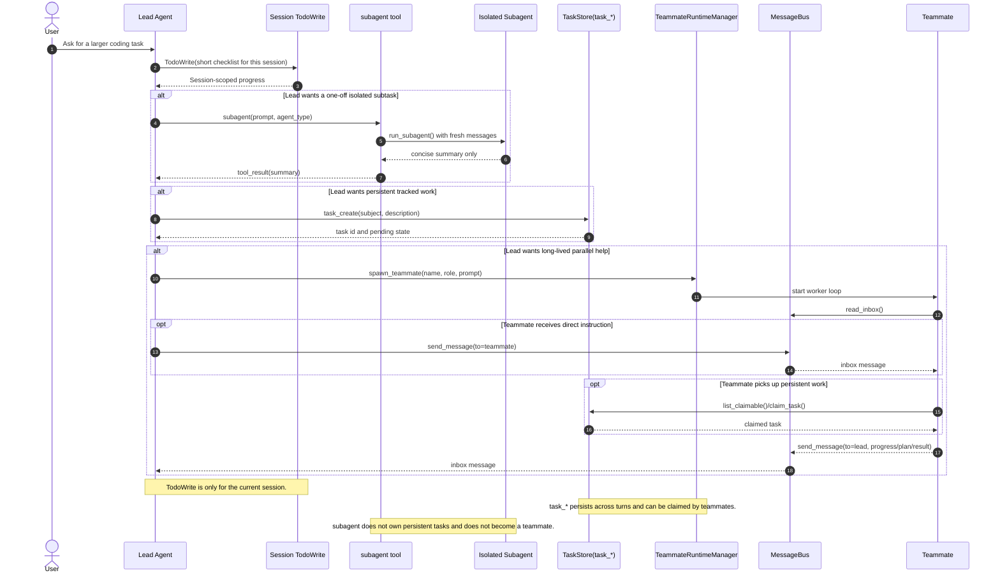

# OpenAgent

OpenAgent is a modular AI agent CLI that ports the feature set of `agents/s_full.py` into a reusable project layout. It keeps the original loop-and-tools interaction model while adding clearer layering for providers, storage, MCP integration, and teammate orchestration.

## Included in this MVP

- Interactive CLI with chat, run, tasks, compact, and doctor flows
- Single-agent loop with tool dispatch
- Filesystem and shell tools with workspace boundaries
- Session-scoped `TodoWrite`
- Persistent task graph
- Isolated subagent execution
- Skill loading from `skills/**/SKILL.md`
- Context micro-compact and transcript-backed auto-compact
- Background shell jobs with notifications
- Message bus, inbox, teammate runtime, shutdown requests, and plan approvals
- Anthropic provider and OpenAI-compatible provider adapters
- MCP client integration over `stdio` and HTTP
- Persistent sessions, transcripts, inbox, team state, and jobs under `.openagent/`

## Coordination Flow

`subagent` is a disposable isolated worker, `task_*` is the persistent task system, and `team` tools manage long-lived teammates. They can be used independently, but the common collaboration flow looks like this:



## Subagent vs Teammate

Both `subagent` and teammates run with their own message history instead of sharing the lead session directly, but they are not equivalent workers.

| Aspect | `subagent` | Teammate (`spawn_teammate`) |
|---|---|---|
| Lifetime | Disposable, one call only | Long-lived worker loop |
| Message context | Fresh isolated `messages` per invocation | Persistent worker-local `messages` across work and idle cycles |
| Entry point | `subagent(prompt, agent_type)` | `spawn_teammate(name, role, prompt)` |
| Returns to lead | One summary string as tool result | Ongoing inbox messages, plan requests, and progress updates |
| Base role | One-off isolated helper | Persistent collaborator |
| Shell tool | Yes | Yes |
| File read | Yes | Yes |
| File write/edit | Only when `agent_type != "Explore"` | Yes |
| `TodoWrite` | No | No |
| Persistent `task_*` tools | No | Yes |
| Inbox / messaging tools | No | Yes |
| Can auto-claim persistent tasks | No | Yes |
| Can spawn more teammates | No | No |
| Can recursively spawn subagents | No | No |

Current tool boundaries in this repo:

- `subagent` gets `bash`, `read_file`, `load_skill`, and optionally `write_file` / `edit_file` for non-`Explore` runs.
- Teammates get `bash`, filesystem tools, `task_create`, `task_get`, `task_update`, `task_list`, `claim_task`, plus worker-local collaboration tools such as `send_message`, `idle`, and `submit_plan`.
- The lead agent has the broader coordination surface: `subagent`, `task_*`, team tools, `TodoWrite`, approvals, and other top-level runtime tools.

Practical rule:

- Use `subagent` when you want a clean one-off investigation or implementation pass and only need a summary back.
- Use a teammate when you want a persistent collaborator that can own tracked work, send updates, and resume later.

## Agent Team

Agent Team is the long-lived collaboration layer in OpenAgent. Unlike `subagent`, which is a disposable isolated helper, a teammate is a named worker managed by `TeammateRuntimeManager` and coordinated through the message bus and persistent task system.

### What a Teammate Is

- A teammate is created with `spawn_teammate(name, role, prompt)`.
- Each teammate runs in its own worker thread with its own message history.
- Teammates do not share the lead session transcript directly.
- Teammates are intended for ongoing collaboration, not one-off isolated delegation.

### Lifecycle

The usual status flow is:

1. `starting`
2. `working`
3. `idle`
4. back to `working` when resumed by inbox messages or claimable tasks
5. `shutdown` when the worker exits

Teammates stop running in these cases:

- The lead sends a `shutdown_request`.
- The teammate stays idle longer than `teammate_idle_timeout_seconds` without new inbox work or claimable tasks.
- The worker loop crashes with a runtime error.
- The OpenAgent process restarts. On the next boot, previously active teammates are repaired to `shutdown` with reason `runtime_restarted`.

### What Persists

Teammates are workspace-scoped rather than session-scoped.

- Team member metadata is persisted under `.openagent/team/team.json`.
- Inbox messages are persisted under `.openagent/inbox/*.jsonl`.
- Persistent tasks used by teammates live under `.openagent/tasks/`.
- Shutdown and plan-approval workflow state lives under `.openagent/requests/`.

Persisted teammate metadata includes:

- `name`
- `role`
- `status`
- `activity`
- `last_transition_at`
- `last_activity_at`
- `shutdown_reason`
- `current_task_id`
- `last_error`

What does not persist:

- The worker thread itself
- The full teammate `messages` history
- In-memory reasoning state inside the worker loop

This means a teammate identity and status survive as project data, but an active worker must be spawned again after shutdown or process restart.

### Tool Surface

Teammates have a narrower tool surface than the lead and a different one than `subagent`.

- Teammates can use shell and filesystem tools.
- Teammates can use persistent `task_*` tools and `claim_task`.
- Teammates can use worker-local collaboration tools such as `send_message`, `idle`, and `submit_plan`.
- Teammates cannot call `TodoWrite`.
- Teammates cannot spawn more teammates.
- Teammates cannot spawn `subagent`.

### When to Use Agent Team

Use teammates when you need:

- A named worker that can keep collaborating over time
- Progress updates through inbox messages
- Ownership of persistent tracked work
- Automatic pickup of claimable tasks while idle

Do not use teammates when you only need:

- A single isolated research pass
- A one-off implementation summary
- A clean temporary context with no persistent ownership

That is the case where `subagent` is the better fit.

## Layout

```text
OpenAgent/
  pyproject.toml
  README.md
  openagent.toml.example
  openagent/
    cli/
    collaboration/
    config/
    mcp/
    providers/
    runtime/
    skills/
    storage/
    tools/
```

## Quick Start

1. Install the package in editable mode:

```bash
pip install -e ./OpenAgent
```

2. Copy the config file:

```bash
cp OpenAgent/openagent.toml.example openagent.toml
```

3. Run a doctor check:

```bash
python -m openagent doctor
```

4. Start interactive chat:

```bash
python -m openagent
```

You can also resume a previous session through the picker:

```bash
python -m openagent -r
```

You can override the provider or model for a single run without editing config files:

```bash
python -m openagent --provider anthropic --model glm-5
python -m openagent --provider openai --model gpt-4.1
python -m openagent run --provider openai --model gpt-4.1 "Summarize this repo"
```

If you install the console entrypoint, the same commands work as:

```bash
openagent
openagent -r
```

## Configuration

OpenAgent reads configuration from:

1. `openagent.toml` in the workspace root

For ad-hoc switching, command-line `--provider` and `--model` overrides take precedence for the current invocation only.

`openagent.toml` is optional. Missing values fall back to defaults from `openagent/config/settings.py`.

### openagent.toml

Supported top-level sections:

- `[agent]`
- `[providers]`
- `[providers.<name>]`
- `[runtime]`
- `[[mcp_servers]]` or `[mcp_servers.<name>]`

Example:

```toml
[agent]
name = "OpenAgent"
# Optional: fully override the built-in base system prompt.
# system_prompt = """
# You are a careful coding agent.
# """

[providers]
default = "anthropic"

[providers.anthropic]
models = ["claude-sonnet-4-5", "claude-3-5-haiku-latest"]
default_model = "claude-sonnet-4-5"
api_key = "replace-me"
# base_url = "https://api.anthropic.com"
# max_tokens = 8000
# timeout_seconds = 120

[providers.openai]
models = ["gpt-4.1", "gpt-4.1-mini"]
default_model = "gpt-4.1"
api_key = "replace-me"
# base_url = "https://api.openai.com/v1"
# organization = "org_xxx"
# max_tokens = 8000
# timeout_seconds = 120

[runtime]
token_threshold = 100000
command_timeout_seconds = 120
background_poll_interval_seconds = 2
teammate_idle_timeout_seconds = 60
teammate_poll_interval_seconds = 5
max_tool_output_chars = 50000
max_subagent_rounds = 30
max_agent_rounds = 50

[[mcp_servers]]
name = "filesystem"
transport = "stdio"
command = "python"
args = ["server.py"]
cwd = "D:/tools/mcp-filesystem"
enabled = false
timeout_seconds = 30
protocol_version = "2025-11-25"

[mcp_servers.unityMCP]
transport = "http"
url = "http://127.0.0.1:8081/mcp"
http_headers = { "X-API-Key" = "replace-me", "Accept" = "text/event-stream" }
startup_timeout_sec = 20
enabled = false
```

### Selecting a Model

There are now three ways to choose the active model:

1. Configure multiple models under `[providers.<name>]` in `openagent.toml`.
2. Use `/model` inside the REPL to interactively switch provider and model.
3. Pass `--provider` and `--model` on the command line for a one-off override.

Examples:

```bash
openagent --provider anthropic --model glm-5
openagent chat --provider anthropic --model claude-sonnet-4-5
openagent run --provider openai --model gpt-4.1 "Explain the failing tests"
openagent doctor --provider openai --model gpt-4.1
```

Inside the REPL, run:

```text
/model
```

OpenAgent will first show a provider picker, then a model picker limited to the models configured under that provider.

### Agent Prompt Configuration

If you set only `agent.name`, OpenAgent uses the built-in default base prompt and injects the configured name into it.

```toml
[agent]
name = "MyAgent"
```

If you set `agent.system_prompt`, that string replaces the built-in base prompt.

```toml
[agent]
name = "CodeReviewer"
system_prompt = """
You are a code review specialist.
Prioritize correctness, regressions, and missing tests.
"""
```

At runtime, OpenAgent also appends role-specific guidance to the base prompt, including:

- current workspace path
- available skills
- tool usage guidance
- current execution environment

The execution environment block tells the model which OS it is running on and how to use the `bash` tool correctly:

- on Unix-like systems, `bash` uses the system shell
- on Windows, `bash` runs PowerShell-compatible commands

That means Windows sessions should prefer commands such as:

- `Get-ChildItem`
- `Get-Content`
- `Select-String`
- `Select-Object`

### MCP Server Configuration

OpenAgent supports both styles below.

Array style:

```toml
[[mcp_servers]]
name = "filesystem"
transport = "stdio"
command = "python"
args = ["server.py"]
cwd = "D:/tools/mcp-filesystem"
enabled = true
```

Named table style:

```toml
[mcp_servers.unityMCP]
transport = "http"
url = "http://127.0.0.1:8081/mcp"
http_headers = { "X-API-Key" = "replace-me", "Accept" = "text/event-stream" }
startup_timeout_sec = 20
enabled = true
```

Supported MCP fields include:

- `transport`
- `url`
- `command`
- `args`
- `cwd`
- `env`
- `http_headers`
- `enabled`
- `timeout_seconds` or `request_timeout_sec`
- `startup_timeout_sec`
- `protocol_version`

## REPL Commands

- `/compact`
- `/model`
- `/tasks`
- `/team`
- `/inbox`
- `/mcp`
- `/toollog`
- `/bg`
- `/help`
- `/exit`

## Notes

- Data is stored under `.openagent/` in the workspace root.
- MCP tools are exposed with the local name format `mcp__<server>__<tool>`.
- MCP config supports both `[[mcp_servers]]` array style and `[mcp_servers.<name>]` table style.
- The OpenAI adapter uses the chat completions API shape so provider differences stay isolated in `providers/`.
